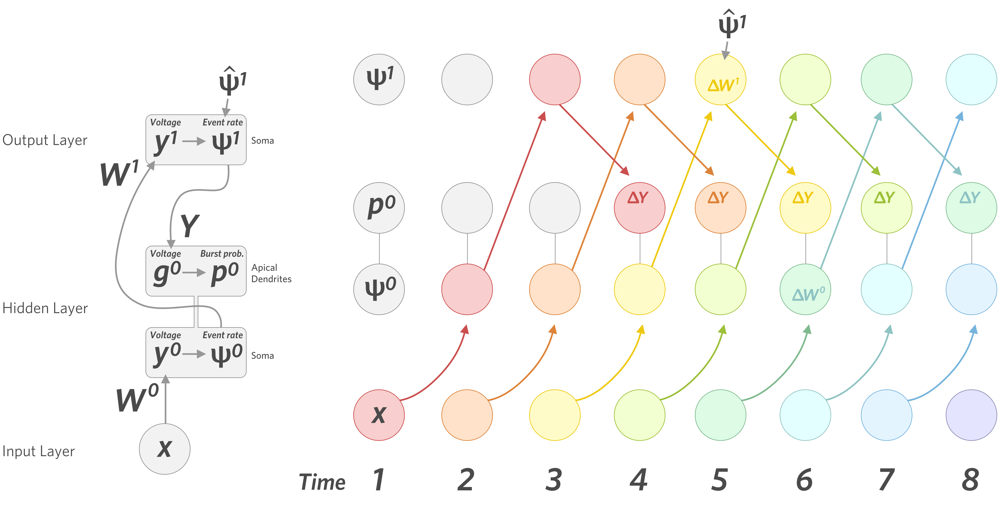
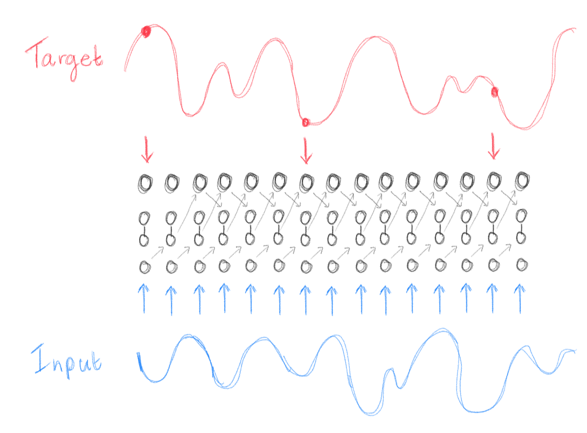

# Temporal Deep Learning

## Dependencies

- `torch`
- `numpy`
- `matplotlib`

## Description

The network here is trained on learning a temporal sequence of outputs given a temporal sequence of inputs. Both the input to the network and the target output are randomly generated sinusoidal curves. During one epoch, the sinusoidal input is presented to the network over time, while the target output is presented to the network only a fraction of the time (currently set to 5%):

Each time step, a hidden layer neuron  calculates its somatic voltage, , by multiplying the exponentially smoothed presynaptic input, , with the feedforward weights  and adding a bias term :

Then, the event rate of a neuron (the number of spiking events per timestep – either a single spike or a burst of spikes), , is given by the standard sigmoid function applied to the somatic voltage:

All hidden layer neurons are fully connected to all output layer neurons. An output layer neuron  calculates its somatic voltage, , by multiplying the exponentially smoothed presynaptic event rates, , with the feedforward weights  and adding a bias term :

The event rate is calculated using the sigmoid function as above. The event rates of the output neurons are considered to be the output of the network.

All output layer neurons are also fully connected to the apical compartments of the hidden layer neurons – these are the feedback connections (although learning still works with only partial feedback connections). For hidden layer neuron , the exponentially smoothed event rates of the output layer neurons are multiplied by the feedback weights  – this becomes the apical voltage . The burst probability (the probability of an event being a burst), , is calculated using the apical voltage, again by applying a standard sigmoid function:

The burst rate (the number of burst events per timestep), , is then simply the product of the burst probability and the event rate:

