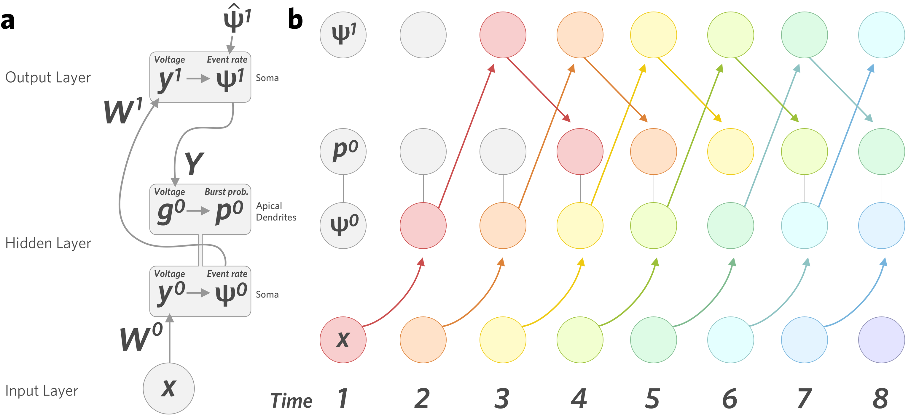

The network here is trained on learning a set of temporal sequences of outputs given a set of temporal sequences of inputs. The length of a sequence is 2000 timesteps. The network has 500 input units and 3 output units. The network with one hidden layer has 300 units in the hidden layer.

## Training Set

The training set consists of 10 classes of input-target sequences – each class is based on a distinct set of input and target sequences which are perturbed slightly in order to generate different examples from that class. Note that the target here refers to the target *event rates* of the output layer units (see Network Structure and Dynamics). For a given class, we first randomly generate the canonical input & target output sequences which examples from that class will be based on. The canonical sequence for input unit $i$ is given by a randomly generated sinusoidal curve:

\begin{equation}
x_i(t) = A_i \text{cos}(B_i t + C_i) + 0.5
\end{equation}

where the amplitude factor $A_i$, the frequency $B_i$ and the phase $C_i$ are drawn from uniform distributions:

\begin{align}
\begin{split}
A_i &\sim \text{U}(0.2, 0.4) \\
B_i &\sim \text{U}(0.005, 0.03) \\
C_i &\sim \text{U}(0, 1)
\end{split}
\end{align}

The canonical target sequences for the 3 output units are generated in order to introduce some complexity in the functions that need to be learned – specifically, XOR functions. This is done because an XOR function cannot be properly learned without a hidden layer of neurons.

For each output unit $j$, we define the target sequence $\hat{\psi}^1_j$ as

\begin{align}
\begin{split}
\hat{\psi}^1_j(t) &= \left\{ \begin{array}{lr}
       0.8 \text{,} \quad \text{ if } x_a(t) > \gamma \text{ or } x_b(t) > \gamma \\
       0.2 \text{,} \quad \text{ if } x_a(t) > \gamma \text{ and } x_b(t) > \gamma \\
       0.2 \text{,} \quad \text{ if } x_a(t) \leq \gamma \text{ and } x_b(t) \leq \gamma
\end{array} \right.
\end{split}
\end{align}

This is the XOR function applied to the thresholded versions of inputs $x_a(t)$ and $x_b(t)$, with a threshold $\gamma$, where $a$ and $b$ are different for each target unit. This creates a square wave, which is finally smoothed by fitting a cubic spline to $\hat{\psi}^1_j$.

$a$ and $b$ are chosen randomly for each output unit. The threshold $\gamma$ is set to $0.5$.

Thus, the target activity for each of the output units is to be active when either input $x_a$ or $x_b$ is active, but not when both are active, regardless of the activities of the other inputs (see Figure 1).

In order to generate training examples from this class, we add random variations to the amplitude and vertical shift of the canonical sequence curves. For input unit $i$ we define:

\begin{align}
\begin{split}
a^x_i (t) &= A^x_i \text{cos}(B^x_i t + C^x_i) + 1 \\
s^x_i (t) &= D^x_i \text{cos}(E^x_i t + F^x_i)
\end{split}
\end{align}

where

\begin{align}
\begin{split}
A^x_i &\sim \text{U}(0.05, 0.2) \\
B^x_i &\sim \text{U}(0.005, 0.05) \\
C^x_i &\sim \text{U}(0, 1) \\
D^x_i &\sim \text{U}(0.01, 0.05) \\
E^x_i &\sim \text{U}(0.005, 0.05) \\
F^x_i &\sim \text{U}(0, 1)
\end{split}
\end{align}

Then, to generate an example sequence, $x_i(t)$ is adjusted so that:

\begin{align}
\begin{split}
x_i(t) &\longrightarrow a^x_i(t) x_i(t) + s^x_i(t)
\end{split}
\end{align}

Similarly, for output unit $j$, we define:

\begin{align}
\begin{split}
a^{\hat{\psi}^1}_k (t) &= A^{\hat{\psi}^1}_k \text{cos}(B^{\hat{\psi}^1}_k t + C^{\hat{\psi}^1}_k) + 1 \\
s^{\hat{\psi}^1}_k (t) &= D^{\hat{\psi}^1}_k \text{cos}(E^{\hat{\psi}^1}_k t + F^{\hat{\psi}^1}_k)
\end{split}
\end{align}

where

\begin{align}
\begin{split}
A^{\hat{\psi}^1}_i &\sim \text{U}(0.05, 0.2) \\
B^{\hat{\psi}^1}_i &\sim \text{U}(0.005, 0.05) \\
C^{\hat{\psi}^1}_i &\sim \text{U}(0, 1) \\
D^{\hat{\psi}^1}_i &\sim \text{U}(0.01, 0.05) \\
E^{\hat{\psi}^1}_i &\sim \text{U}(0.005, 0.05) \\
F^{\hat{\psi}^1}_i &\sim \text{U}(0, 1)
\end{split}
\end{align}

and, to generate an example sequence, $\hat{\psi}^1_i(t)$ is adjusted so that:

\begin{align}
\begin{split}
\hat{\psi}^1_k(t) &\longrightarrow a^{\hat{\psi}^1}_k(t) \hat{\psi}^1_k(t) + s^{\hat{\psi}^1}_i(t)
\end{split}
\end{align}

Figure 2 shows some of the input & target sequences generated for different classes, and training examples drawn from each class.

## Network Structure and Dynamics

A diagram showing the network structure and dynamics is shown in Figure 3. Assume the network has $l$ inputs, $m$ hidden units and $n$ output units. Unit $j$ in the hidden layer has two compartments: a somatic compartment with voltage $y^0_j$ and an apical dendrite compartment with voltage $g^0_j$. At time $t$, $y^0_j(t)$ is given by:

\begin{align}
\begin{split}
y^0_j(t) &= \sum_{i=1}^l W^0_{jk} \tilde{x}_i (t-1) + b^0_j
\end{split}
\end{align}

where $\bm{W}^0$ is the $m \times l$ matrix of the synaptic weights between the inputs and hidden layer units, $\bm{b}^0$ is a vector containing bias terms for each hidden unit, and $\tilde{\bm{x}}$ is the exponentially smoothed input layer activity:

\begin{align}
\begin{split}
\label{eqn:exponential_smoothing}
\tilde{x}_i(0) &= x_i(0) \\
\tilde{x}_i(t) &= \frac{1}{2}(x_i(t) + \tilde{x}_i(t-1)) \text{, } t > 0
\end{split}
\end{align}

The hidden unit's *event rate* $\psi^0_j$, defined as the expected number of spike events (either single spikes or bursts) per unit time, is given by a sigmoid applied to the somatic voltage:

\begin{align}
\begin{split}
\psi^0_j(t) &= \sigma(y^0_j(t)) = \frac{1}{1 + e^{-y^0_j(t)}}
\end{split}
\end{align}

This signal is received by units in the output layer. Unit $k$ in the output layer has a somatic compartment with somatic voltage $y^1_k$ given by:

\begin{align}
\begin{split}
y^1_k(t) &= \sum_{j=1}^m W^1_{ij} \tilde{\psi}^0_j(t-1) + b^1_k
\end{split}
\end{align}

where $\bm{W}^1$ are the feedforward synaptic weights between the hidden layer and output layer units, $\bm{b}^0$ are the bias terms for each output unit, and $\tilde{\bm{\psi}}^0$ are the exponentially smoothed event rates of the hidden layer units, computed as in equation \eqref{eqn:exponential_smoothing}. Similarly, the event rate of output unit $k$, $\psi^1_k$, is given by:

\begin{align}
\begin{split}
\psi^1_k(t) &= \sigma(y^1_k(t)) = \frac{1}{1 + e^{-y^1_k(t)}}
\end{split}
\end{align}

During some time steps, a target conductance nudges $\psi^1_k(t)$ towards the target $\hat{\psi}^1_k(t)$ (see Training and Testing). During these time steps, $\psi^1_k(t)$ is instead given by:

\begin{align}
\begin{split}
\label{eqn:final_output_nudging}
\psi^1_k(t) &= \frac{1}{2}(\sigma(y^1_k(t)) + \hat{\psi}^1_k(t))
\end{split}
\end{align}

Finally, the apical dendrite compartments of hidden layer units receive this signal from the output layer units. The apical voltage $g^0_j$ is given by:

\begin{align}
\begin{split}
g^0_j(t) &= \sum_{k=1}^n Y_{jk} \tilde{\psi}^1_k(t-1)
\end{split}
\end{align}

where $\bm{Y}$ are the feedback synaptic weights between the output layer and hidden layer units, and $\tilde{\bm{\psi}}^1$ are the exponentially smoothed event rates of the output layer units, computed as in equation \eqref{eqn:exponential_smoothing}. The hidden unit's *burst probability* $p^0_j$, defined as the probability that a spike event will be a burst (rather than a single spike), is the given by applying the sigmoid function to the apical voltage:

\begin{align}
\begin{split}
p^0_j(t) &= \sigma(g^0_j(t)) = \frac{1}{1 + e^{-g^0_j(t)}}
\end{split}
\end{align}

Finally, the *burst rate* $\varphi^0_j$ is the product of the burst probability and the event rate:

\begin{align}
\begin{split}
\varphi^0_j(t) &= p^0_j(t) \psi^0_j(t)
\end{split}
\end{align}

## Training and Testing
Training occurs over a number of epochs. The networks in the presented results were all trained for 20 epochs. During one epoch, each of the 100 training sequences (10 sequences per class) are randomly presented to the network in sequence. While the input sequences $\bm{x}(t)$ are shown continuously, the target sequences $\hat{\bm{\psi}}^1(t)$ are only occasionally shown to the network – at each time step, there is a 5% chance of a target being presented. When a target is not presented, the the input $\bm{x}(t)$ simply propagated through the network, affecting the event rates and burst probabilities of the units. When a target is presented, the event rate of the output layer units is nudged towards this target, and feedforward weights throughout the network are updated (see Weight Updates). During time steps when the target is present, we record the training loss at each layer of the network (see Loss Functions).

Following training, the network is tested on a separate set of 10 test sequences, one per class. The test error for a given test sequence is defined as the mean absolute difference between the event rates of the output layer units and their target event rates:

\begin{align}
\begin{split}
\text{Test error} &= \frac{1}{nT} \sum_{t = 1}^{T} \sum_{k = 1}^{n} |\hat{\psi}^1_k(t) - \psi^1_k(t)|
\end{split}
\end{align}

where $T=2000$, the length of the sequence. Finally, each of the networks with one hidden layer are shown the 10 test sequences again, but halfway through each sequence are made to generate activity using feedback only (see Generating Activity Using Feedback).

## Loss Functions
Loss functions are computed and feedforward weights are updated in order to descend their gradient only when a target, $\hat{\bm{\psi}}^1(t)$, is presented to the network. As shown above, if the target $\hat{\bm{\psi}}^1(t)$ is shown to the network at time $t$, it will also push the event rates of the output layer units closer to this target (equation \eqref{eqn:final_output_nudging}). Thus, at time $t$, we can define the loss function for the output layer as:

\begin{align}
\begin{split}
L^1(t) &= || \bm{\psi}^1(t) - \bm{\psi}^1(t-1) ||^2_2
\end{split}
\end{align}

As the network learns to minimize this loss, $\bm{\psi}^1(t)$ will approach $\hat{\bm{\psi}}^1(t)$ when the target is shown to the network, and this the network will also indirectly descend the following loss function:

\begin{align}
\begin{split}
L^{1*}(t) &= || \hat{\bm{\psi}}^1(t) - \bm{\psi}^1(t-1) ||^2_2
\end{split}
\end{align}

For the hidden layer, we first define a target event rate $\hat{\bm{\psi}}^0(t)$ as:

\begin{align}
\begin{split}
\hat{\psi}^0_j(t) &= \psi^0_j(t-1) + p^0_j(t) - p^0_j(t-1)
\end{split}
\end{align}

Then, the loss function is defined as:

\begin{align}
\begin{split}
L^0(t) &= || \hat{\bm{\psi}}^0(t) - \bm{\psi}^0(t-1) ||^2_2 \\
       &= || p^0_j(t) - p^0_j(t-1) ||^2_2
\end{split}
\end{align}

When the target $\hat{\bm{\psi}}^1(t)$ is presented to the network, feedforward weights are updated in order to descend the gradients of $L^1$ and $L^0$.

## Weight Updates
Feedforward weight updates at the final layer occur at time $t$ only if the target $\hat{\bm{\psi}}^1(t)$ is presented to the network. The feedforward weights $W^1$ and biases $b^1$ are updated as:

\begin{align}
\begin{split}
W^1_kj &\longrightarrow W^1_kj + \epsilon^1(\psi^1_k(t) - \psi^1_k(t-1))\psi^1_k(t-1)(1 - \psi^1_k(t-1)) \cdot \tilde{\psi}^0_j(t-1) \\
b^1_k &\longrightarrow b^1_k + \epsilon^1(\psi^1_k(t) - \psi^1_k(t-1))\psi^1_k(t-1)(1 - \psi^1_k(t-1))
\end{split}
\end{align}

where $\epsilon^1$ is the learning rate, set to $0.01$.

Feedforward weights at the hidden layer occur at the following timestep, $t+1$, as this is when the target information arrives at the apical compartments of hidden layer units. The feedforward weights $W^0$ and biases $b^0$ are updated as:

\begin{align}
\begin{split}
W^0_ji &\longrightarrow W^0_ji + \epsilon^0(p^0_j(t+1) - p^0_j(t))\psi^0_j(t)(1 - \psi^0_j(t)) \cdot \tilde{x}_i(t) \\
&= W^0_ji + \epsilon^0(p^0_j(t+1) - \varphi^0_j(t))(1 - \psi^0_j(t)) \cdot \tilde{x}_i(t) \\
b^0_j &\longrightarrow b^0_j + \epsilon^0(p^0_j(t+1) - p^0_j(t))\psi^0_j(t)(1 - \psi^0_j(t)) \\
&= b^0_j + \epsilon^0(p^0_j(t+1) - \varphi^0_j(t))(1 - \psi^0_j(t))
\end{split}
\end{align}

where $\epsilon^0$ is the learning rate, set to $10.0$.

## Feedback Weight Updates
When training with feeback weight updates, feedback weights $Y$ are updated at every time step $t$ in order to descend the loss function:

\begin{align}
\begin{split}
L^Y(t) &= || \bm{\psi}^0(t) - \bm{\varphi}^0(t) ||^2_2
\end{split}
\end{align}

Thus, feedback weights $Y$ are updated as:

\begin{align}
\begin{split}
Y_jk &\longrightarrow Y_jk + \epsilon^Y(\psi^0_j(t) - \varphi^0_j(t))\psi^0_j(t)p^0_j(t)(1 - p^0_j(t)) \cdot \tilde{\psi}^1_k(t)
\end{split}
\end{align}

where $\epsilon^Y$ is the learning rate, set to $0.0001$.

## Generating Activity Using Feedback
In order to generate activity using the feedback of the output layer, we present a sequence $\bm{x}$ to the network after it has been trained. Starting halfway through the sequence ($t = 1000$), the event rates of the hidden layer units, $\bm{\psi}^0$, are set to be equal to their burst rates $\bm{\varphi}^0$:

\begin{align}
\begin{split}
\psi^0_j(t) = \varphi^0_j(t)
\end{split}
\end{align}

Thus, for the second half of the sequence, the event rates of the hidden layer units, which drive the event rates at the output layer, are determined only by their burst rates, which in turn are determined by the feedback from the output layer.

The generation error is defined similarly to the test error, it is the mean difference between the output of the network and the target during the second half of the sequence:

\begin{align}
\begin{split}
\text{Generation error} &= \frac{1}{n(T/2)} \sum_{t = T/2}^{T} \sum_{k = 1}^{n} |\hat{\psi}^1_k(t) - \psi^1_k(t)|
\end{split}
\end{align}

where $T=2000$, the length of the sequence.

## Figure Descriptions

**avg_final_layer_training_losses_comparison**. Plot of output layer loss $L^1$ over 20 epochs of training, averaged every 100 timesteps. Shown is the full range over 5 trials (light colors) and the mean across 5 trials (darker colors). (Note: x axis label should be Training Example, not Epoch).

**mean_test_error_comparison**. Plot of test error after 20 epochs of training, across 5 trials. For each network, there are 50 data points, corresponding to 5 trials, with 10 sequences (one from each class) being tested in each. The bars are the means.

**mean_generation_error_comparison**. Plot of the generation error after 20 epochs of training, across 5 trials. For each network, there are 50 data points, corresponding to 5 trials, with 10 sequences (one from each class) being tested in each. The bars are the means.

**activity**. *Top:* Plot of the target output and output (event rate) of the network during the first sequence of training. Dots represent when the target was shown to the network. *Bottom:* Plot of the target output and output of the network after training, during the test sequence that is the same class as in the top plot.

**generated_activity**. Plot of the target output and output of the network after training, where after 1000 timesteps the network begins to generate activity without input.